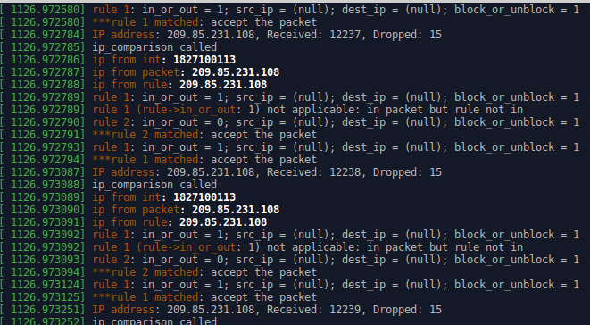
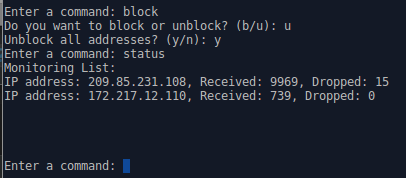
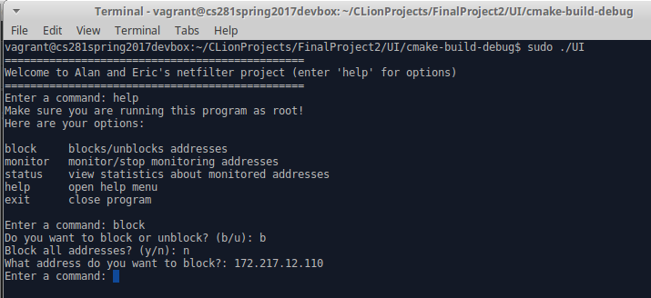

## Implementation:

The kernel module is essentially implemented using two netfilter hooks (one for local incoming, the other for local outgoing packets), a linked list of runtime policy rules, and a linked list of IP addresses that are to be monitored and the number of received and dropped packets from that address.

In greater detail, the init_module function registers the two netfilter hooks and creates the file system. Via the UI shell, other functions are often called. The "add_rule" function registers a new runtime polcy that specifies whether it applies to incoming or outgoing traffic, the source and destination IP addresses (0 or NULL for all), and the required action (block or unblock). This function adds the new rule to the front of the linked list structure, thereby allowing the overriding of rules. For example, unblocking all packets after blocking them would correctly accept all the packets. The "add_monitor" function registers a new IP address to monitor. An incoming or outgoing packet results in "hook_func_in" or "hook_func_out" being called, respectively. The former first traverses the list of monitors and finds the relevant one, if any, by calling "ip_comparison". This function takes the unsigned integer IP address of the netfilter hook and converts them to a readable IPv4 string before comparing it with the address stored in the monitor or rule. Then "hook_func_in" or "hook_func_out" traverse the list of rules and either accepts or drops the packet depending on the desired action. If this packet is being monitored, this also triggers the incrementing of the number of packets received or dropped.

You can follow this logic by reading the log messages in "dmesg".

The functionality is demonstrated here:

)

The init_module function also creates a proc file called "firewall_rules", which the UI shell can interact with by writing to. When it is written to, the proc_write callback function is invoked and the data is written to a global character array, msg. The first char in msg specifies what type of instruction to carry out, and the remaining instructions (if there are any) specify the IP address. So within the write, msg is parsed to determine the proper function to invoke within the module, as well as pass in the required parameters. With a call to status, the module prepares for a read callback and writes data from its monitors to the msg variable.
Cleanup frees all memory, including the proc file, unregisters the hooks, and frees both the monitoring and run-time policies list.

*Note: the project instruction stated that we were to "implement the ability to filter incoming/outgoing traffic from/to specific addresses." We took this to mean that the user is able to block BOTH the incoming and outgoing traffic with respect to a particular IP address. (And thus each block command would essentially create two "rules") We could have just as easily allowed the user to specify ONLY blocking outgoing or ONLY blocking incoming packets, however this seemed less practical to us.*

## CLI Commands:

From the user perspective, the design of the UI is pretty standard. The initial commands that are available are “help”, “monitor”, “block”, “status”, and “exit”. “help” and “exit” are fairly self-explanatory. “monitor” prompts the user to input whether or not they want to monitor/stop monitoring a specific IP address. Then, the user is asked to input the IP address. If the IP is valid it invokes a callback write to /proc/firewall_rules, writing a character to communicate to the kernel module which action to take, followed by the IP address. Blocking/unblocking are done in a similar manner, and these options are also prompted to the user when they input “block”. “block” also has an option to determine whether or not you want to block/unblock all addresses, rather than inputting a specific one. Finally, “status” communicates to the kernel module that it must write its monitoring data to the msg field. The program sleeps temporarily, and then reads the data from firewall_rules and prints it out to the console.

## Netfilter Hooks:

Netfilter hooks are structures that are triggered (or rather trigger the kernel module that have registered them) at certain points when packets progress through the network stack and provide the backbone of a netfilter. In Linux they are implemented as part of a struct nf_hook_ops.
The certain type of hook that a packet will activate depends on its metadata: whether it is incoming or outgoing, its destination, and whether it was previously dropped or rejected.

The five general netfilter hooks are:

* NF_IP_PRE_ROUTING (called right after a packet has been received)
* NF_IP_LOCAL_IN (used for packets that are destined for network stack and not been forwarded)
* NF_IP_FORWARD (packets that should be forwarded)
* NF_IP_POST_ROUTING (packets that have been routed)
* NF_IP_LOCAL_OUT (packets sent out from our own network stack)

In our netfilter program, we used two of them: NF_IP_LOCAL_IN and NF_IP_LOCAL_OUT.

## Testing:

To test blocking, unblocking, and monitoring received packets we simply pinged small websites that only use 1 server, got their IP address, and manipulated it accordingly to make sure the behavior matched the requirements. Furthermore, because the end of ping returned with the number of packets received and percentage dropped, this gave us a great tool to verify our results.To check the behavior, we used dmesg to check the kernel logs and “status” to check our own. To test dropping packets, because they had to be incoming ones, we opened up a streaming website like YouTube. YouTube had many different IP addresses, so we would monitor and block a few of them. Then we would wait for a little while, and check the status to ensure the packets were being dropped (and when unblocked, that they were received). As shown in our second image, we even tested more complex (even edge) cases. We added multiple rules, checked the behavior of monitors when we drastically changed the rules from blocking all to unblocking all, and performed successive monitoring and unmonitorings.

## Future: Stateful Firewall:

In order to implement something like a stateful firewall, it would be necessary to keep track of the context from each packet within a given connection (this allows us to know if a packet is part of an existing connection, trying to establish a new one, or a rogue). So, for each unique dest/src IP pair, we would need to create either a linked_list or some other struct that stores data about that connection. That way, each incoming packet can first be screened and dynamically vetted by its context, by looking at previous packets sent through that same connection. In the same way that a list structure was created for monitors and rules, so too would a structure have to be defined for each packet. That way, additional information about each packet within the list could also be recorded. Finally, as each packet is vetted from the different connection, their cummulative data would need to be stored in a state table. That state table would also be used as part of the vetting process as more information was updated.

More specifically, a good start would be to add a protocol field to the firewall_rule struct, which would allow each rule to work on UDP or TCP packets, as opposed to both. A ip_header->protocol value of 17 means UDP and 6 means TCP. Furthermore, adding a port field also gives some more flexibility in this regard.

## Future: Quotas:

The module already keeps track of how many packets are being received from a specific address, but it would also need to keep track of how many packets are being sent to a specific address in order to limit traffic going in both directions. The same monitoring structures that were used in hook_func_in would be copied to hook_func_out so that we can put a limit on outgoing traffic as well (this time monitoring the destination IP). Once a certain number of packets, dependent upon the quota, were registered as being received or sent, a corresponding rule would be created to start dropping those packets. Specifically, right where we checked the is_monitored condition (before a packet is dropped or accepted), we would include another statement that would evaluate whether the current number of packets received has exceeded this quota and, if so, call add_rule and at the end drop the packet. We would pass a firewall_rule struct containing the packet IP address, which would ensure that all further packets from that IP address without any additional checks.

## Linux Kernel:

There are a variety of reasons why Linux does not support a binary kernel interface. For one thing, kernel drivers can look different depending on which C compiler is used, which can lead to different behavior (especially with regards to the implementation of data structures). Additionally, because Linux is so versatile on so many different architectures, the binary drivers would also have to be compatible across different system architectures.
However, perhaps the biggest reason is because Linux does not even have a stable kernel interface to begin with. What makes Linux so popular is the fact that it is constantly being improved, and when that happens function names, parameters, structures, and other variables will change. Therefore, unless the driver was originally within the main kernel tree, it may not still be compatible. That is why some code gets outdated when written for Linux (such as the netfilter examples). As a result, it simply isn’t worth the time to support a consistent ABI.
